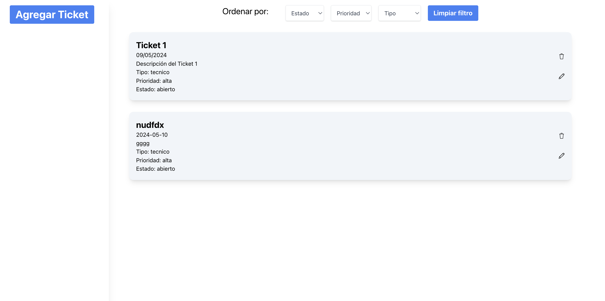
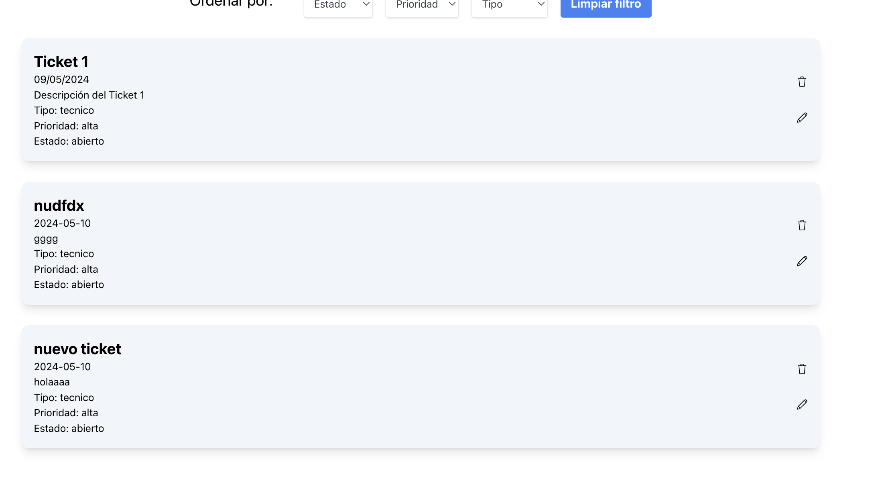
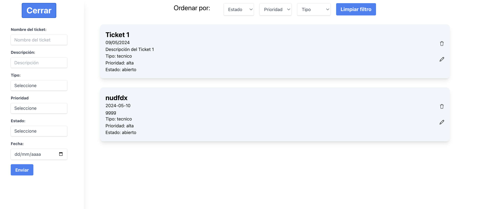

# Cards-App

En Cards-App podrás crear tickest de requerimiento, listarlos y editarlos. Conocenos en el siguiente link: [Cards-App](https://mayrenejose.github.io/cards-App/).

## Herramientas

- React JS.
- Redux.
- Tailwin CSS.

### Imagenes

